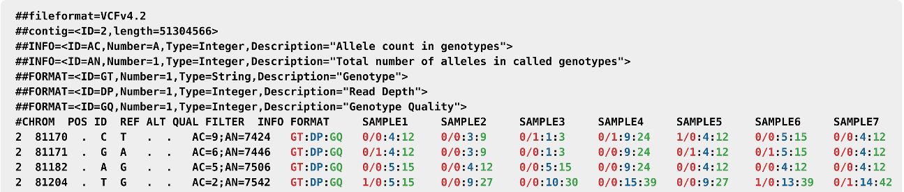
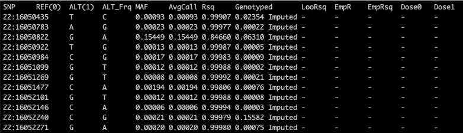
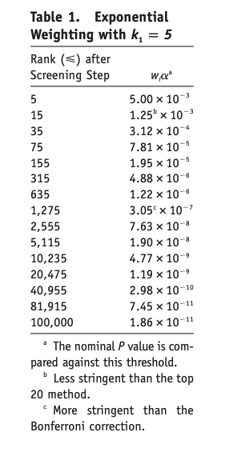
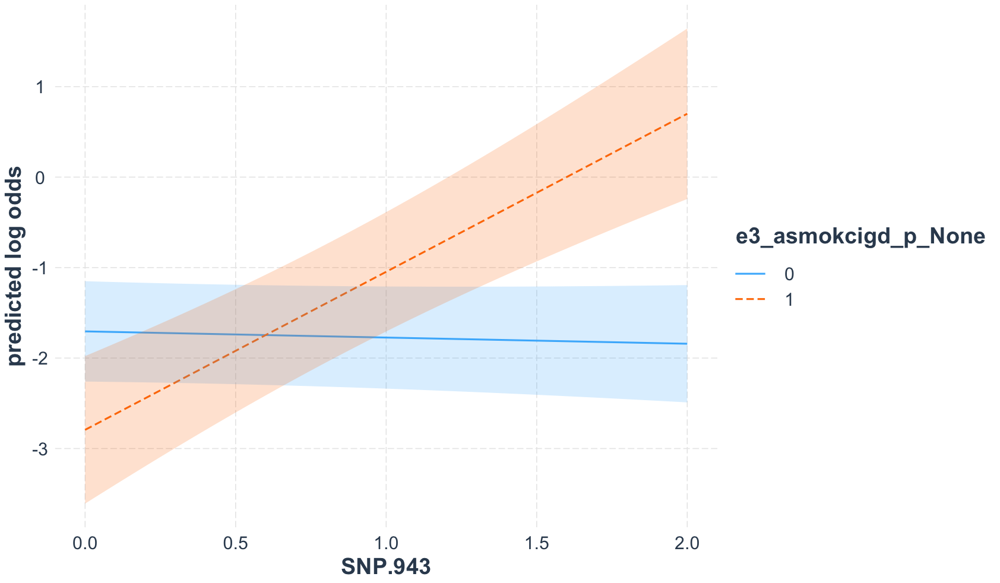

<!-- ```{css, echo=FALSE} -->
<!-- pre { -->
<!--   max-height: 200px; -->
<!--   overflow-y: auto; -->
<!-- } -->
<!-- ``` -->

```{r setup, include=FALSE, echo=FALSE}
library(tidyverse)
library(MultiAssayExperiment)
library(knitr)
library(ggplot2)
library(reshape2)
library(gap)
library(kableExtra)
library(broom)
library(nnet)

options(knitr.table.format = "html")
knitr::opts_chunk$set(echo = TRUE)

# suppress warning messages for final rendering
old.warn <- getOption("warn")
options(warn=-1)

# load functions to create GWIS plots
source("interaction_functions.R")
```

# Introduction

Apply methods discussed in lecture to search for GxE interactions in the **HELIX** data set

* Run simple interaction test examples
* Introduce genome-wide by environment interaction scans (GWEIS) using `BinaryDosage`/`GxEScanR`
* Conduct GWEIS of maternal alcohol use and childhood BMI 
* Conduct GWEIS of maternal smoking and childhood BMI


# HELIX study
<!-- ### Data descriptions for interactions -->

As mentioned, the HELIX study is a collaborative project across six longitudinal population-based birth cohort studies in six European countries (France, Greece, Lithuania, Norway, Spain, and the United Kingdom).  

We will use data from the subcohort of 1,301 mother-child pairs (**N = 1,122 with complete data**), specifically exposure and genomic data from children 6-11 years old, to investigate GxE interactions between fetal alcohol/smoking exposures and genetic variants, and their influence on future childhood BMI.  

List of outcome and exposure variables of interest:

* **hs_bmi_c_cat (Outcome)** - Body mass index, dichotomized
  + 0 = Thinness/Normal
  + 1 = Overweight/Obese (WHO reference)
* **e3_alcpreg_yn_None (Exposure)** - Maternal alcohol use during pregnancy
  + 0 = Never
  + 1 = Ever
* **h_mbmi_None** - Maternal pre-pregnancy body mass index
  + kg/m2 (continuous)
* **e3_sex_None** - Sex
  + 0 = Female
  + 1 = Male
* **h_age_None** - Maternal age
  + years (continuous)
* **h_cohort** - Cohort country
  + 1 = France 
  + 2 = Greece
  + 3 = Lithuania
  + 4 = Norway
  + 5 = Spain 
  + 6 = UK
* **h_edumc_None** - Maternal education
  + 1 = primary school
  + 2 = secondary school
  + 3 = university degree or higher
* **ethn_PC1/2** - principal components (ethnicity)

<br>

## Data processing

Throughout this workshop, we will be using `HELIX.MultiAssayExperiment`, an R object that stores multiple data sets measured on the same individuals (e.g. epidemiological data, a number of *omic* experiments, etc)

Begin by obtaining the variables we are interested in, and combining them into a `data.frame`  

```{r GxE: Processing the Data, echo=TRUE, cache = T}
# ---- Load RData containing HELIX MultiAssayExperiment object ---- #
load("~/Google Drive/My Drive/SHARP.MultiomicsWorkshop.USC.share/data/HELIX.MultiAssayExperiment.RData")

# ---- specify variable names to extract ---- #
outcome.Name <- "hs_bmi_c_cat"
exposure.Name <- "e3_alcpreg_yn_None"
covariate.Names <- c("h_mbmi_None","e3_sex_None","h_age_None","h_cohort","h_edumc_None","ethn_PC1","ethn_PC2")
snp.Names <- paste("SNP", 1:1000, sep=".")
# putting it all together
variables <- c(covariate.Names, exposure.Name, "h_ethnicity_cauc", snp.Names)

# ---- extract variables from HELIX.MultiAssayExperiment ---- #
# 1) select variables to keep
# 2) `intersectionColumns` selects only individuals with complete data (N = 1,122)
# 3) `wideFormat` returns as a data.frame
# d <- wideFormat(intersectColumns(helix_ma[variables, ,]), colDataCols=outcome.Name)
# saveRDS(d, "data/d_alcohol.rds")
d <- readRDS("data/d_alcohol.rds")

# ---- Genotype design matrix ---- #
X <- d[,grep("SNP", names(d))]
names(X) <- snp.Names
X <- as.matrix(X)

# ---- Epi data.frame ---- #
dataset <- data.frame(d[,c("primary", "hs_bmi_c_cat", "lifestyles_e3_alcpreg_yn_None",
"covariates_h_mbmi_None", "covariates_e3_sex_None", "covariates_h_age_None",
"covariates_h_cohort", "covariates_h_edumc_None", "proteome.cov_ethn_PC1",
"proteome.cov_ethn_PC2", "proteome.cov_h_ethnicity_cauc")])

# Rename columns for this example
names(dataset) <- c("primary", "hs_bmi_c_cat", "e3_alcpreg_yn_None",
"h_mbmi_None", "e3_sex_None", "h_age_None",
"h_cohort", "h_edumc_None", "ethn_PC1",
"ethn_PC2", "h_ethnicity_cauc")

# Dichotomize outcome variable
dataset$hs_bmi_c_cat <- factor(ifelse(as.numeric(dataset$hs_bmi_c_cat)>=3, 1, 0), label = c("Thin/Normal", "Overweight/Obese"))

# Code variables properly (numeric vs factor)
dataset[, c("h_mbmi_None", "h_age_None", "ethn_PC1", "ethn_PC2")] <- lapply(dataset[, c("h_mbmi_None", "h_age_None", "ethn_PC1", "ethn_PC2")], as.numeric)
dataset[, c("e3_alcpreg_yn_None", "e3_sex_None", "h_cohort")] <- lapply(dataset[, c("e3_alcpreg_yn_None", "e3_sex_None", "h_cohort")], factor)
dataset$h_edumc_None <- factor(dataset$h_edumc_None, label = c("Primary school", "Secondary school", "University degree or higher"))

# Other variables for analysis (for convenience)
N <- nrow(d) # number of individuals in the analysis
P <- ncol(X)  # number of SNPs in the matrix X
```

<br> 
 
## Descriptive statistics

```{r echo = T, message=F}
library(table1) 
label(dataset$e3_alcpreg_yn_None) <- "Maternal alcohol during pregnancy"
label(dataset$h_age_None) <- "Maternal age"
label(dataset$e3_sex_None) <- "Child sex"
label(dataset$h_mbmi_None) <- "Maternal pre-pregnancy BMI"
label(dataset$h_edumc_None) <- "Maternal education"

# run table1 function
table1(~ e3_alcpreg_yn_None +
         h_age_None + 
         e3_sex_None +
         h_edumc_None +
         h_mbmi_None | hs_bmi_c_cat, data=dataset)
```

<br>

## Univariate association tests

```{r, echo = T, results='asis', message = F}

univariate_vars <- c("e3_alcpreg_yn_None", "h_age_None", "e3_sex_None", "h_edumc_None", "h_mbmi_None")

univariate.results <- t(sapply(univariate_vars, FUN=function(p) {  # using index p facilitate write
  x <- dataset[,p]
  reg <- glm(dataset$hs_bmi_c_cat ~ as.numeric(x), family=binomial)    # perform logistic regression
  s.reg <- summary(reg)                 # get the summary for the regression
  c.reg <- s.reg$coef[2,]               # select the coefficients for the exposure
  return(c.reg)                         
}, simplify=T))
univariate.results <- data.frame(univariate_vars,univariate.results)
names(univariate.results) <- c("Variable","Estimate", "SD","Z.Statistic", "P-value")
univariate.results$`P-value` <-  format(univariate.results$`P-value`, scientific=T)

kable(univariate.results) %>% 
  kable_styling(bootstrap_options = c("striped", "hover"), full_width = F, position = 'left')
```

<br>

## Genomic data {.tabset}

Genotype data includes `r P` single nucleotide polymorphisms (SNPs)

### Plot of genetic ancestry (PCA)
```{r Genome: PC plot, echo=TRUE}
plot(d$proteome.cov_ethn_PC1, d$proteome.cov_ethn_PC2, pch=16, col=ifelse(d$proteome.cov_h_ethnicity_cauc=="yes", 1, 2),
     xlab="Component 1", ylab="Component 2")
legend(x="topleft", legend=c("Caucasian", "Other"), col=c(1,2), pch=16)
```

### Correlation matrix for local genomic region
```{r Genome: cor.plot, echo=TRUE}
cormat <- round(cor(X[,1:(P/5)], use="complete.obs"), 2)
cormat[lower.tri(cormat)]<- NA
melted_cormat <- melt(cormat)
ggplot(data = melted_cormat, aes(Var2, Var1, fill = value))+
  geom_tile(color = "white")+
  scale_fill_gradient2(low = "blue", high = "red", mid = "white",
                       midpoint = 0, limit = c(-1,1), space = "Lab",
                       name="Pearson\nCorrelation") +
  theme_minimal()+
  theme(axis.text.x = element_blank(), axis.text.y = element_blank())+
  labs(y= "SNPs", x = "SNPs")+
  coord_fixed()

```

<br>

----

<br>


# G x Maternal alcohol use and childhood BMI

**Question: is there effect heterogeneity for the association of maternal alcohol consumption and childhood BMI by germline genetics?**

<br>

## Simple interaction model

The most commonly used method for testing for interaction is fitting a traditional logistic regression model with an interaction term in the form $$logit(Pr D=1|G,E) = \alpha + \beta_EE + \beta_GG + \beta_{GxE}G*E$$

Testing the hypothesis $H0:\beta_{GxE} = 0$ is equivalent to testing whether the ratio $\frac{OR_{GxE}}{OR_G*OR_E} = 1$ e.g. departure from multiplicative effects. 

In this example, let's start with `SNP.1`.   

We will adjust all models by:   

* maternal age
* maternal pre-pregnancy BMI
* maternal education
* study country
* sex
* ancestry (2 principal components)


```{r}
SNP.1 <- X[,1]

model <- glm(hs_bmi_c_cat ~ e3_alcpreg_yn_None * SNP.1 + h_age_None + h_mbmi_None +  h_cohort + h_edumc_None + e3_sex_None + ethn_PC1 + ethn_PC2, data = dataset, family = 'binomial')

tidy(model)
```

The interaction term `e3_alcpreg_yn_None1:SNP.1` has p.value = 0.48, meaning we cannot reject the null hypothesis and do not conclude there is statistically significant interaction on a multiplicative scale. 

<br>

We can also fit a case-only model, which is shown to be more powerful provided the G-E independence assumption is met. The polytomous regression model is in the form $$logit(Pr G=g|E, D=1) = \gamma_0 + \gamma_1 + \gamma_EE$$

```{r}
caseonly <- which(dataset$hs_bmi_c_cat == "Overweight/Obese")

SNP.1 <- factor(X[,1][caseonly])
dataset_caseonly <- dataset[caseonly, ]

model_caseonly <- multinom(SNP.1 ~ e3_alcpreg_yn_None + h_age_None + h_mbmi_None +  h_cohort + h_edumc_None + e3_sex_None + ethn_PC1 + ethn_PC2, data = dataset_caseonly)

tidy(model_caseonly)
```

We can check for G-E independence by testing their association among controls:

```{r}
controlonly <- which(dataset$hs_bmi_c_cat == "Thin/Normal")

SNP.1 <- X[,1][controlonly]
dataset_controlonly <- dataset[controlonly, ]

model_caseonly <- lm(SNP.1 ~ e3_alcpreg_yn_None + h_age_None + h_mbmi_None +  h_cohort + h_edumc_None + e3_sex_None + ethn_PC1 + ethn_PC2, data = dataset_controlonly)

tidy(model_caseonly)
```

<br>

## Genome-wide interaction scan {.tabset  .tabset-fade}

To test for interactions genome-wide, we fit the same traditional logistic regression models for every SNP. In this example, since m = `r P` we can use a simple loop:

```{r GxE: Univariate model, echo=TRUE, cache = T}

start = Sys.time()

int.results <- t(sapply(1:ncol(X), FUN=function(p) {  # using index p facilitate write
    g <- X[,p]
    reg <- glm(hs_bmi_c_cat ~ g*e3_alcpreg_yn_None + h_age_None + h_mbmi_None +  h_cohort + h_edumc_None + e3_sex_None + ethn_PC1 + ethn_PC2, data = dataset, family=binomial)    # perform logistic regression
    s.reg <- summary(reg)                 # get the summary for the regression
    c.reg <- as.numeric(s.reg$coef["g:e3_alcpreg_yn_None1", ]) # select the coefficients
    return(c.reg)                         # to avoid potential memory issues only return coefficients if small number of exposures
  }, simplify=T))
  int.results <- data.frame(paste("E:SNP", 1:ncol(X), sep="."), int.results)
  names(int.results) <- c("E:SNP.Name","Estimate", "SD","Z.statistic", "P.value")

stop = Sys.time() - start; stop
```


<!-- <br> -->

<!-- ### GxE Univariate Summary Table: -->
<!-- ```{r GxE: Univariate table} -->
<!-- kable(int.results[int.results$P.value<0.05,], digits=3, align="c", row.names=FALSE, col.names=c("E:SNP","Estimate", "SD","Z statistic", "P value")) -->
<!-- ``` -->

<br>

### GxE Univariate Manhattan Plot:
```{r GxE: Univariate MH plot}
neglog.pvalues <- -log10(int.results$P.value)
plot(1:nrow(int.results), neglog.pvalues,
     pch=16, xaxt="n", ylim=c(0, max(neglog.pvalues, 3)),
     ylab="-log(p-value)", xlab="SNPs")
abline(h=-log10(0.05/nrow(int.results)), lty=2, lwd=2, col=2)
```

<br>

### GxE Univariate QQ-Plot:
```{r GxE: QQ-plot}
pvalues <- int.results$P.value
r <- gcontrol2(pvalues, pch=16)
lambda <- round(r$lambda,3)
text(x=1, y=5, labels=bquote(lambda == .(lambda)), cex=2)
```

## 

In this case, it does not appear there are signficant GxE interactions between maternal alcohol use and genetic variants in the 1000 SNPs we tested. 

<br>

## `BinaryDosage`, `GxEScanR`

Genome-wide interaction scans can be computationally expensive when the number of markers exceed several million, as is often the case in imputed genotype data. Imputation is a useful tool in genomics that enables association testing with markers not directly genotyped, increasing statistical power and facilitating data pooling between studies.   

BinaryDosage/GxEScanR is a set of software packages that efficiently performs interaction scans of imputed data (VCF and gen/sample format), and implements several of the methods discuss in the lecture portion.  

These packages are available on CRAN:  

* https://cran.r-project.org/web/packages/GxEScanR/index.html
* https://cran.r-project.org/web/packages/BinaryDosage/index.html

`BinaryDosage` converts imputed genomic data into a binary format that facilitates data storage, management, and analysis. Input files must be in VCF or gen/sample format. 

`GxEScanR` is designed to efficiently run genome-wide association study (GWAS) and genome-wide by environmental interaction study (GWEIS) scans using imputed genotypes stored in the `BinaryDosage` format. The phenotype to be analyzed can either be a continuous or binary trait. The GWEIS scan performs multiple tests that can be used in two-step methods.

## Data preparation

`BinaryDosage` accepts imputed genomic data in the following formats: 

* `VCF`/`INFO` format (**Minimac3/4**, Michigan Imputation Server)
* `GEN`/`Sample` format (**Impute2**)

`GxEScanR` uses two input files to conduct GWIS:   

* `BinaryDosage` file 
* covariate text file - first two columns must contain ID and outcome variables, the last column must contain the interaction variable

While `BinaryDosage` will accept outputs from the imputation software mentioned above, in this example I create the required input files manually for illustration purposes. 

`VCF` format - refer to https://samtools.github.io/hts-specs/VCFv4.2.pdf for VCF file specifications



`INFO` file 




```{r, echo = T, eval = F}

# ---- VCF/INFO files ---- #

# generate VCF file using design matrix as input
vcf <- data.frame(t(X)) # transpose
# dummy values for this example only
vcf$chr <- "chr1"
vcf$pos <- seq(1,1000)
vcf$ID <- snp.Names
vcf$FORMAT <- "DS"
vcf[c('REF', 'ALT', 'QUAL', 'FILTER', 'INFO', 'Sample')] <- rep('.', nrow(vcf))
vcf <- vcf[, c('chr', 'pos', 'ID', 'REF', 'ALT', 'QUAL', 'FILTER', 'INFO', 'FORMAT')]
colnames(vcf) <- c('#CHROM', 'POS', 'ID', 'REF', 'ALT', 'QUAL', 'FILTER', 'INFO', 'FORMAT')
vcfout <- cbind(vcf, data.frame(t(X)))
write.table(vcfout, "./data/alcohol.vcf", quote = F, row.names = F, col.names = T, sep = "\t")

# Generate INFO file
info <- vcf[, c('ID', 'REF', 'ALT')]
info[c('AAF', 'MAF', 'AvgCall', 'Rsq')] <- rep(0.9, nrow(vcf))
info$Genotyped = "imputed"
info[c('LooRsq', 'EmpR', 'EmpRsq', 'Dose0', 'Dose1')] = "-"
info <- info[, c('ID', 'REF', 'ALT', 'AAF', 'MAF', 'AvgCall', 'Rsq', 'Genotyped', 'LooRsq', 'EmpR', 'EmpRsq', 'Dose0', 'Dose1')]
colnames(info) <- c('SNP', 'REF(0)', 'ALT(1)', 'ALT_Frq', 'MAF', 'AvgCall', 'Rsq', 'Genotyped', 'LooRsq', 'EmpR', 'EmpRsq', 'Dose0', 'Dose1')
write.table(info, "./data/alcohol.info", quote = F, row.names = F, col.names = T, sep = "\t")

# ---------------------------------- #
# ---- output BinaryDosage file ---- #
# ---------------------------------- #
library(BinaryDosage)
BinaryDosage::vcftobd(vcffiles = c("./data/alcohol.vcf", './data/alcohol.info'), gz = FALSE, bdfiles = "./data/alcohol.bdose")

# ------------------------------- #
# ---- output covariate file ---- #
# ------------------------------- #
# create covariate file with indicator variables for factors
# make sure it fits requirements specified in GxEScanR documentation
covariates <- c("hs_bmi_c_cat", "h_mbmi_None", 
"e3_sex_None", "h_age_None", "h_cohort", "h_edumc_None", "ethn_PC1", 
"ethn_PC2",  "e3_alcpreg_yn_None")
dataset_gxescan <- data.frame(model.matrix(as.formula(paste("~-1+", paste(covariates, collapse = "+"))), data = dataset))
dataset_gxescan <- dataset_gxescan[ , -which(colnames(dataset_gxescan) %in% "hs_bmi_c_catThin.Normal")]
ID <- paste0("X", seq(1, 1122, 1))
dataset_gxescan <- cbind(ID, dataset_gxescan)

write.table(dataset_gxescan, "./data/covar_alcohol.txt", row.names = F, quote = F, sep = '\t')
```

## Run GxEScanR

```{r, echo = T}
library(GxEScanR)

# Run GxEScanR
bdinfo <- BinaryDosage::getbdinfo("data/alcohol.bdose")
covar <- read.table("data/covar_alcohol.txt", stringsAsFactors = F, header = T)

start = Sys.time()
output <- GxEScanR::gweis(data = covar, bdinfo = bdinfo)
stop = Sys.time() - start; stop

# create EDGE statistic (used in two-step method)
output$lrtedge = output$lrtdg + output$lrteg


```


## Post-processing

A quick look at `GxEScanR` output:

```{r, echo = T}
kable(head(output)) %>% 
   kable_styling(bootstrap_options = c("striped", "hover"), full_width = F, position = 'left')
```

Output contains statistics to assess interactions using traditional logistic regression, case-only analysis, 2DF/3DF. It also outputs statistics we can use to implement several two-step methods. 


### D|G (G main effects)

We can look at the Q-Q / Manhattan plots of genotype main effects:  


```{r}
pvalues <- pchisq(output[, 'lrtdg'], df = 1, lower.tail = F)
r <- gcontrol2(pvalues, pch=16)
lambda <- round(r$lambda,3)
text(x=1, y=5, labels=bquote(lambda == .(lambda)), cex=2)
  
```

```{r}
neglog.pvalues <- -log10(pchisq(output[,"lrtdg"], lower.tail = F, df = 1))
plot(1:nrow(output), neglog.pvalues,
     pch=16, xaxt="n", ylim=c(0, max(neglog.pvalues, 3)),
     ylab="-log(p-value)", xlab="SNPs")
abline(h=-log10(0.05/nrow(output)), lty=2, lwd=2, col=2)
```


### GxE test

GxE interaction Q-Q / Manhattan plots - should be identical to results above, except that `GxEScanR` uses LRT, while glm outputs Wald: 

```{r}
pvalues <- pchisq(output[, 'lrtgxe'], df = 1, lower.tail = F)
r <- gcontrol2(pvalues, pch=16)
lambda <- round(r$lambda,3)
text(x=1, y=5, labels=bquote(lambda == .(lambda)), cex=2)
```

```{r}
neglog.pvalues <- -log10(pchisq(output[,"lrtgxe"], lower.tail = F, df = 1))
plot(1:nrow(output), neglog.pvalues,
     pch=16, xaxt="n", ylim=c(0, max(neglog.pvalues, 3)),
     ylab="-log(p-value)", xlab="SNPs")
abline(h=-log10(0.05/nrow(output)), lty=2, lwd=2, col=2)
```


### Joint testing (2DF)

2DF test (Kraft et al 2007)

$$logit(Pr D=1|G,E) = \alpha + \beta_EE + \beta_GG + \beta_{GxE}G*E$$ 
where we test the hypothesis $\beta_G = \beta_{GxE} = 0$

```{r}
pvalues <- pchisq(output[, 'lrt2df'], df = 2, lower.tail = F)
r <- gcontrol2(pvalues, pch=16)
lambda <- round(r$lambda,3)
text(x=1, y=5, labels=bquote(lambda == .(lambda)), cex=2)
```

```{r}
neglog.pvalues <- -log10(pchisq(output[,"lrt2df"], lower.tail = F, df = 2))
plot(1:nrow(output), neglog.pvalues,
     pch=16, xaxt="n", ylim=c(0, max(neglog.pvalues, 3)),
     ylab="-log(p-value)", xlab="SNPs")
abline(h=-log10(0.05/nrow(output)), lty=2, lwd=2, col=2)
```


### Joint testing (3DF)

Test the hypothesis $\beta_G = \beta_{GxE} = \gamma_G = 0$

where $\gamma_0$ is the G|E association in combined case/control sample (see Murcray 2009, Gauderman 2019)

```{r}
pvalues <- pchisq(output[, 'lrt3df'], df = 3, lower.tail = F)
r <- gcontrol2(pvalues, pch=16)
lambda <- round(r$lambda,3)
text(x=1, y=5, labels=bquote(lambda == .(lambda)), cex=2)
```

```{r}
neglog.pvalues <- -log10(pchisq(output[,"lrt3df"], lower.tail = F, df = 3))
plot(1:nrow(output), neglog.pvalues,
     pch=16, xaxt="n", ylim=c(0, max(neglog.pvalues, 3)),
     ylab="-log(p-value)", xlab="SNPs")
abline(h=-log10(0.05/nrow(output)), lty=2, lwd=2, col=2)
```


### Two-step methods 

We can use marginal statistics (G|D main effect) to filter SNPs prior to conducting GxE testing. For example, filter SNPs based on their D|G statistic at a $\alpha < 0.05$ level:  

```{r}

# calculate p-values, filter at alpha < 0.05 threshold
output$step1_pvalue <- pchisq(output$lrtdg, lower.tail = F, df = 1)
output$step2_pvalue <- pchisq(output$lrtgxe, lower.tail = F, df = 1)
output_filter <- output[which(output$step1_pvalue < 0.05), ]

# check GxE significance in smaller subset (N = 62)
output_filter$pvalue_bonferroni <- p.adjust(output_filter$step2_pvalue, method = 'bonferroni')
output_filter_significant <- output_filter[which(output_filter$pvalue_bonferroni < 0.05),]

output_filter_significant # EMPTY

```

Why did we choose $\alpha < 0.05$ for subset testing? Is there an optimal choice? 

### Two-step methods - weighted hypothesis testing

Rather than choosing an $\alpha$ cut-off, we can include all SNPs by using the step 1 statistic to weight step 2 testing. This way, we do not need to make a decision regarding the appropriate step 1 p-value cutoff, while still maintaining overall $\alpha = 0.05$. 

We use the weighted hypothesis testing framework described in Ionita-Laza et al (2007). Specifically, we partition SNPs into exponentially larger bins (with an initial bin size of 5), each with an increasingly more stringent step 2 significance threshold. Essentially, we are giving 'preferential treatment' to SNPs with strong step 1 statistics, and testing them at a lower interaction significance threshold. 


The partitioning scheme from Ionita-Laza is as follows:



Now onto our results - we partition SNPs into bins and check for significance
```{r}

# ---- create exponential bins ---- #
sizeBin0 = 5 # initial bin size = 5
m = 997 # number of SNPs
nbins = ceiling(log2(m/sizeBin0 + 1)) # 8 bins to accommodate 1000 SNPs
sizeBin = c(sizeBin0 * 2^(0:(nbins-2)), m - sizeBin0 * (2^(nbins-1) - 1) )

# ---- sort by step 1 statistic (in this case, lrtdg), assign bins ---- #
endpointsBin = cumsum(sizeBin)
bin <- ceiling(log(c(1:m)/sizeBin0+1,base=2))

table(bin)

alphaBin = 0.05 * 2 ^ -(1:nbins) / sizeBin
alphaBin_dat <- rep(alphaBin, table(bin))

# ---- show that overall alpha is ~ 0.05 ---- #
sum(alphaBin * sizeBin)

# ---- assign bins, check for significance ---- #
# sort by lrtdg statistic
output_twostep <- output[order(-output[,'lrtdg']), ]
output_twostep$bin_number <- bin
output_twostep$step2p_sig <- as.numeric(alphaBin_dat)

# IN THIS CASE - NO significant interactions
output_twostep_significant <- output_twostep[which(output_twostep$step2p_pvalue < output_twostep$step2p_sig),]

kable(output_twostep_significant) %>% 
  kable_styling(bootstrap_options = c("striped", "hover"), full_width = F)

```

Visualizing two-step method bins + SNPs is helpful: 

```{r}

# calculate log pvalues for plotting
output_twostep$log_step2p        <- -log10(output_twostep$step2_pvalue)
output_twostep$log_step2p_siglvl <- -log10(output_twostep$step2p_sig)
output_twostep_plot                   <- split(output_twostep, f = list(output_twostep$bin_number))

# create 'base pair' for each bin so SNPs are plotting evenly
create_mapinfo <- function(x) {
    mapinfo <- seq(unique(x$bin_number) - 1 + 0.1, unique(x$bin_number) - 1 + 0.9, length.out = nrow(x))
    out <- cbind(x, mapinfo)
    return(out)
  }
output_twostep_plot <- lapply(output_twostep_plot, create_mapinfo)


# PLOT
binsToPlot = length(output_twostep_plot)
color <- rep(c("#377EB8","#4DAF4A"),100)
par(mar=c(6, 7, 6, 3))
bin_to_plot = output_twostep_plot[[1]]
plot(bin_to_plot$mapinfo, bin_to_plot$log_step2p,
     col = ifelse(bin_to_plot$snp %in% output_twostep_significant[, 'snp'], '#E41A1C','#377EB8'),
     pch = ifelse(bin_to_plot$snp %in% output_twostep_significant[, 'snp'], 19, 20),
     cex = ifelse(bin_to_plot$snp %in% output_twostep_significant[, 'snp'], 1.3, 1.7),
     xlab="Bin number for step1 p value",
     ylab="-log10(step2 chiSqGxE p value)",
     xlim=c(0, binsToPlot),
     ylim=c(0, 12),
     axes=F,
     cex.main = 1.7,
     cex.axis = 1.7,
     cex.lab = 1.7,
     cex.sub = 1.7)
lines(bin_to_plot$mapinfo, bin_to_plot$log_step2p_siglvl, col = "black", lwd=1)

# remaining bins
for(i in 2:binsToPlot) {
  bin_to_plot = output_twostep_plot[[i]]
  points(bin_to_plot$mapinfo, bin_to_plot$log_step2p,
         col = ifelse(bin_to_plot$snp %in% output_twostep_significant$snp, '#E41A1C', color[i]),
         pch = ifelse(bin_to_plot$snp %in% output_twostep_significant$snp, 19, 20),
         cex = ifelse(bin_to_plot$snp %in% output_twostep_significant$snp, 1.3, 1.7),
         cex.main = 1.7,
         cex.axis = 1.7,
         cex.lab = 1.7,
         cex.sub = 1.7)
  lines(bin_to_plot$mapinfo, bin_to_plot$log_step2p_sig, col = "black",lwd = 1)
}
axis(1, at = c(-1.5, seq(0.5, binsToPlot-0.2, 1)), label = c(0, seq(1, binsToPlot, 1)), cex.axis = 1.7)
axis(2, at = c(0:floor(12)), label = c(0:12), cex.axis=1.7)

```

<br>
<br>
<br>

Let's look at all the results for alcohol X gene analysis now. I wrapped all the steps above in functions for convenience, you can refer to them in the file `interaction_functions.R`

<br>

----

<br>


## Q-Q plots {.tabset .tabset-fade}

### D|G
```{r, echo = T}
plot_qq(output, 'lrtdg', 1)
```

### GxE
```{r, echo = T}
plot_qq(output, 'lrtgxe', 1)
```

### Case only
```{r, echo = T}
plot_qq(output, 'lrtcase', 1)
```

### 2DF
```{r, echo = T}
plot_qq(output, 'lrt2df', 2)
```

### 3DF
```{r, echo = T}
plot_qq(output, 'lrt3df', 3)
```

##

<br>

## Manhattan plots {.tabset .tabset-fade}

### D|G
```{r, echo = T}
plot_manhattan(output, 'lrtdg', 1)
kable(sig_table(output, 'lrtdg', 1)) %>% kable_styling(bootstrap_options = c("striped", "hover"), full_width = F)
```

### GxE
```{r, echo = T}
plot_manhattan(output, 'lrtgxe', 1)
kable(sig_table(output, 'lrtgxe', 1)) %>%  kable_styling(bootstrap_options = c("striped", "hover"), full_width = F)
```

### Case-only
```{r, echo = T}
plot_manhattan(output, 'lrtcase', 1)
```

### 2DF
```{r, echo = T}
plot_manhattan(output, 'lrt2df', 2)
```

### 3DF
```{r, echo = T}
plot_manhattan(output, 'lrt3df', 3)
```

##

<br>


## Two-step methods {.tabset .tabset-fade}

### Twostep D|G
```{r, echo = T}
plot_twostep(output, step1_statistic = 'lrtdg', step1_df = 1, sizeBin0 = 5, alpha = 0.05)
kable(sig_twostep(output, step1_statistic = 'lrtdg', step1_df = 1, sizeBin0 = 5, alpha = 0.05)) %>% kable_styling(bootstrap_options = c("striped", "hover"), full_width = F)
```

### Twostep E|G
```{r, echo = T}
plot_twostep(output, step1_statistic = 'lrteg', step1_df = 1, sizeBin0 = 5, alpha = 0.05)
kable(sig_twostep(output, step1_statistic = 'lrteg', step1_df = 1, sizeBin0 = 5, alpha = 0.05)) %>% kable_styling(bootstrap_options = c("striped", "hover"), full_width = F)
```

### Twostep EDGE
```{r, echo = T}
plot_twostep(output, step1_statistic = 'lrtedge', step1_df = 2, sizeBin0 = 5, alpha = 0.05)
kable(sig_twostep(output, step1_statistic = 'lrtedge', step1_df = 2, sizeBin0 = 5, alpha = 0.05)) %>% kable_styling(bootstrap_options = c("striped", "hover"), full_width = F)
```

##

<br>

----

<br>

----

<br>

# Your turn 

<br>

----

<br>

----

<br>

# G x Maternal smoking and childhood BMI

Perform GxE analysis using `GxEScanR` to assess interactions between maternal smoking + genetic variants in determining childhood BMI. All necessary files and functions are provided for expediency. 

How many interactions between smoking and SNPs do you identify with traditional logistic regression?
How many interactions do you identify using two-step methods?


# G x Maternal smoking and childhood BMI

Perform GxE analysis using `GxEScanR` to assess interactions between maternal smoking + genetic variants in determining childhood BMI. All necessary files and functions are provided for expediency. 

How many interactions between smoking and SNPs do you identify with traditional logistic regression?
How many interactions do you identify using two-step methods?


### Run GxEScanR
```{r}
library(BinaryDosage)
library(GxEScanR)

# run GxEScanR
bdinfo <- BinaryDosage::getbdinfo("data/smoking.bdose")
covar <- read.table("data/covar_smoking.txt", stringsAsFactors = F, header = T)
output <- GxEScanR::gweis(data = covar, bdinfo = bdinfo)

output$lrtedge = output$lrtdg + output$lrteg
```


### Generate plots and tables

Focus on GxE + two-step methods 

```{r, eval = T}
# GxE
plot_manhattan(output, 'lrtgxe', 1)
kable(sig_table(output, 'lrtgxe', 1)) %>%  kable_styling(bootstrap_options = c("striped", "hover"), full_width = F, position = 'left')


# Two-step method - filter by genetic main effect
plot_twostep(output, step1_statistic = 'lrtdg', step1_df = 1, sizeBin0 = 5, alpha = 0.05)
kable(sig_twostep(output, step1_statistic = 'lrtdg', step1_df = 1, sizeBin0 = 5, alpha = 0.05)) %>% kable_styling(bootstrap_options = c("striped", "hover"), full_width = F)


# Two-step method - filter by gene | exposure association among combined case/control population
plot_twostep(output, step1_statistic = 'lrteg', step1_df = 1, sizeBin0 = 5, alpha = 0.05)
kable(sig_twostep(output, step1_statistic = 'lrteg', step1_df = 1, sizeBin0 = 5, alpha = 0.05)) %>% kable_styling(bootstrap_options = c("striped", "hover"), full_width = F)


# Two-step method - filter by EDGE statistic
plot_twostep(output, step1_statistic = 'lrtedge', step1_df = 2, sizeBin0 = 5, alpha = 0.05)
kable(sig_twostep(output, step1_statistic = 'lrtedge', step1_df = 2, sizeBin0 = 5, alpha = 0.05)) %>% kable_styling(bootstrap_options = c("striped", "hover"), full_width = F)

```

<br>

----

<br>

## Results Summary

<br>

## Q-Q plots {.tabset .tabset-fade}

### D|G
```{r, echo = T}
plot_qq(output, 'lrtdg', 1)
```

### GxE
```{r, echo = T}
plot_qq(output, 'lrtgxe', 1)
```

### Case only
```{r, echo = T}
plot_qq(output, 'lrtcase', 1)
```

### 2DF
```{r, echo = T}
plot_qq(output, 'lrt2df', 2)
```

### 3DF
```{r, echo = T}
plot_qq(output, 'lrt3df', 3)
```

## 

## Manhattan plots {.tabset .tabset-fade}

### D|G
```{r, echo = T}
plot_manhattan(output, 'lrtdg', 1)
kable(sig_table(output, 'lrtdg', 1)) %>%  kable_styling(bootstrap_options = c("striped", "hover"), full_width = F)
```

### GxE
```{r, echo = T}
plot_manhattan(output, 'lrtgxe', 1)
kable(sig_table(output, 'lrtgxe', 1)) %>%  kable_styling(bootstrap_options = c("striped", "hover"), full_width = F, position = 'left')
```

### Case-only
```{r, echo = T}
plot_manhattan(output, 'lrtcase', 1)
```

### 2DF
```{r, echo = T}
plot_manhattan(output, 'lrt2df', 2)
```

### 3DF
```{r, echo = T}
plot_manhattan(output, 'lrt3df', 3)
```

## Two-step methods {.tabset}

### Twostep D|G
```{r, echo = T}
plot_twostep(output, step1_statistic = 'lrtdg', step1_df = 1, sizeBin0 = 5, alpha = 0.05)
kable(sig_twostep(output, step1_statistic = 'lrtdg', step1_df = 1, sizeBin0 = 5, alpha = 0.05)) %>% kable_styling(bootstrap_options = c("striped", "hover"), full_width = F)
```

### Twostep E|G
```{r, echo = T}
plot_twostep(output, step1_statistic = 'lrteg', step1_df = 1, sizeBin0 = 5, alpha = 0.05)
kable(sig_twostep(output, step1_statistic = 'lrteg', step1_df = 1, sizeBin0 = 5, alpha = 0.05)) %>% kable_styling(bootstrap_options = c("striped", "hover"), full_width = F)
```

### Twostep EDGE
```{r, echo = T}
plot_twostep(output, step1_statistic = 'lrtedge', step1_df = 2, sizeBin0 = 5, alpha = 0.05)
kable(sig_twostep(output, step1_statistic = 'lrtedge', step1_df = 2, sizeBin0 = 5, alpha = 0.05)) %>% kable_styling(bootstrap_options = c("striped", "hover"), full_width = F)
```

##

<br>

---- 

<br>


## Closer look at SNP.943

### Stratified odds ratios

```{r, echo = F}
est <- readRDS("~/Desktop/snp.943_or.rds")

options(knitr.kable.NA = '')
kable(est) %>%
  kable_styling('bordered', bootstrap_options = c("striped", "hover", "condensed"), full_width = F, position = 'left') %>%
  add_header_above(c(" " = 4, "G param by E" = 2, "Counts (Ca/Co)" = 3)) %>%
  pack_rows("E param by G", 5, 6, indent = F)

```


### Interaction plot



