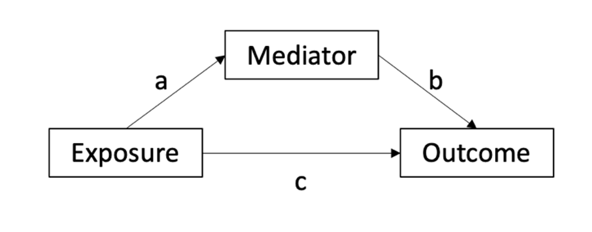

```{css, echo=FALSE}
pre {
  max-height: 200px;
  overflow-y: auto;
}
```

```{r setup}
options(knitr.table.format = "html")
knitr::opts_chunk$set(echo = TRUE, message = FALSE)
```


```{r load package}
# install.packages("/Users/yinqiz/Documents/Research/exposome_data_challenge/LUCIDus_2.1.0.tar.gz",
#                  repos = NULL,
#                  type = "source",
#                  dependencies = TRUE)
library(ggplot2)
library(tidyverse)
library(Biobase)
library(lavaan)
library(HIMA)
library(bama)
library(LUCIDus)
library(reshape2)
library(networkD3)
```


## 1. Introduction to Mediation Analysis
Previously, we studied how to analyze and interpret the association between exposure and outcome of interest. However, statistical association sometimes is not enough to fully address the research question. For example, if we are studying how environmental exposure, say exposure to organochlorines (a chemical compound in pesticides), influences obesity in children, we are increasingly interested in the mechanisms behind the statistical association. In other words, we want to understand how organochlorines (independent variable) exert influence to obesity (dependent variable). Insulin is a well known peptide hormone which regulates the metabolism of carbohydrates and fats in human body and is directly related to obesity based on experimental evidence. If we believe insulin will explain the biological process (mechanism) between exposure and outcome, our research question then becomes

* Does exposure to organochlorine lead to deviant insulin level in children which ultimately leads to obesity?

Such question indicates a chain of relations where the independent variable affects the outcome through a third variable called mediator. Of course, the mediator is not restricted to biological factor. It can be psychological, social, environmental or even political variables. The standard statistical framework for answering the question above is called **mediation analysis**. In short, mediation analysis is a collection of regression models fitted on different combinations of exposure, outcome and mediator. Baron and Kenny (1986) outlined the basic steps for the classical framework of mediation analysis. For better illustration of mediation analysis, we first define some notations and concept.

### Notation and Definition 
1. $X$: Exposure (independent variable)
2. $Y$: Outcome (dependent variable)
3. $M$: Mediator (a third variable which explains the mechanism of statistical association between $X$ and $Y$)
4. Total effect (TE): the statistical association of $X$ on $Y$. TE can be partitioned into direct effect and indirect effect.
5. Indirect effect (IDE): the statistical association of $X$ on $Y$ transmitted through $M$.
6. Direct effect (DE): the variance of $Y$ in TE that cannot be explained by IDE

The rest of the tutorial is organized as the following sections: (1) simple mediation analysis based on linear regression; (2) extension of simple mediation model to multiple mediators; (3) other advanced mediation analysis methods, including latent mediation model and high dimensional mediation model.

## 2. Simple Mediation Analysis
To start with, we introduce mediation analysis framework based on linear regression, although the idea can be naturally extended to generalized linear regression. The mediation analysis can be expressed in terms of statistical language, which is illustrated below. 

Here $a$ and $b$ represent the coefficients of the associations between exposure and mediator and between mediator and outcome, respectively. The product of $a$ and $b$ is referred as IDE. The direct effect, DE, is the coefficient $c$. Following the basic step suggested by Baron and Kenny (1986), the mediation analysis consists of three steps (regression models):

1. $X \rightarrow Y$
2. $X \rightarrow M$
3. $X + M \rightarrow Y$

We will go through each step by using the example question: whether insulin level mediates the association between exposure to organochlorine and obesity in children?
```{r, message=FALSE}
dat = read_csv("~/Documents/Study_USC/TA/SHARP/mediation/data.csv")
X = dat$hs_hcb_madj_Log2
M = dat$INSULIN
Y = dat$hs_zbmi_who
dat1 = data.frame(X = X, M = M, Y = Y)
```


### Step 1: Total Effect
The first step is to analyze the total effect. The regression model is written as
$$
Y = c_0 + cX + \epsilon
$$
where $\epsilon$ represents the normally distributed error. We want to investigate whether $X$ significantly affects $Y$. 
```{r}
model_1 = lm(Y ~ X, data = dat1)
summary(model_1)
```
The exposure to organochlorine significantly associated with BMI of children, measured in BMI z-score. Although this is what Baron and Kenny originally proposed for mediation analysis, however, this step is controversial. Shrout and Bolder (2002) argue that we can still detect mediation effect even the total effect is not significant. Now in practice, the first step of mediation analysis is used as reference for researchers to get a sense of the overall association. We will move forward with mediation analysis no matter $c$ (TE) is significant or not.

### Step 2: Mediator Model
The model we fit in the second step is called **mediator model**, specifically, it is 
$$
M = a_0 + aX + \epsilon
$$
Still, $\epsilon$ represents the random error. If $X$ is not significantly associated with $M$, then $M$ is just a third variable instead of a mediator which explains the mechanism between $X$ and $Y$. 
```{r}
model_2 = lm(M ~ X, data = dat1)
summary(model_2)
```

### Step 3: Outcome Model
The model we fit in step 3 is called **outcome model**, including both exposure $X$ and mediator $M$.
$$
Y = b_0 + c'X + bM + \epsilon
$$
What we we are interested in is to compare $c'$ here to $c$ in the model fitted in step 1. If $X$ influences $Y$ through $M$, by introducing $M$ in the outcome model, the effect of $X$ on $Y$ will become weaker or even disappear. If the effect of $X$ gets weaker, we detect **partial mediation effect**. If it disappears, we detect **fully mediation** effect. Here disappearance refers to statistical non-significance.
```{r}
model_3 = lm(Y ~ X + M, data = dat1)
summary(model_3)
```

In our example, the coefficient of $X$ (exposure to Hexachlorobenzene in mother during pregnancy) is not significant anymore while $M$ (insulin) is significant in the outcome model. Besides, the effect of $X$ decreases from 0.06 to 0.04, so a fully mediation effect is detected. Once we observe the evidence of mediation effect, we want to conduct inference on the mediation effect. This is conveniently done by an R package called `mediation`.

### Step 4: Causal Mediation Analysis
```{r, message=FALSE}
library(mediation)
result_simple_mediation = mediate(model_2, model_3, treat = "X", mediator = "M", boot = T)
```
The main function in `mediation` is `mediate()`. Two models are required to conduct causal mediation analysis in `mediate()` (corresponding to our conclusion in step 1, even TE is not necessary to detect mediation effect): the first model is the mediation model obtained from step 2 and the second is the outcome model from step 3. By setting `boot = T`, we use bootstrapping method to generate confidence interval for mediation effect. It takes some time to run the code because bootstrap is a replicated process of drawing sample with replacement from the original data and then conducting mediation analysis based on the new sample. By default, 1000 replications are used to build the confidence interval for our analysis.
```{r}
summary(result_simple_mediation)
```

The total effect is the coefficient of $X$ in step 1: $X \rightarrow Y$. The direct effect (ADE) is $c'$ in the outcome model obtained from step 3. The mediation effect (ACME) is the product of coefficient $a$ in step 2 and the coefficient $b$ in step 3. It also equals the total effect $c$ minus the direct effect $c - c'$. `Prop.Mediated` represents 36% of variance in $Y$ is explained through the mediation effect. Overall, we detect a significant mediation effect (0.0242, p < 0.01) of insulin between exposure to Hexachlorobenzene in mother and childhood obesity.

## 3. Mediation Analysis with Multiple Mediator
In some cases, one single mediator is not enough to explain the biology behind the statistical association and it is of particular interest to incorporate multiple omics variables in mediation analysis. Back to our example, we previously discussed the mediation effect of insulin between exposure to Hexachlorobenzene in mother and obesity in children. Tumour necrosis factor (TNF)-alpha has been found over-expressed in adipose tissue from obese animals and human. Nieto-Vazquez (2008) conducted comprehensive molecular biological study to explore the mechanism how TNF-alpha regulates insulin resistance. As a result, it is natural to include TNF-alpha in our mediation pathway and jointly analyze the mediation effect of TNF-alpha and insulin towards obesity.

The general pipeline of mediation analysis with multiple mediators is similar to the simple mediation framework. Here we utilize an R pakcage `lavaan` to achieve the goal of multiple mediation analysis, which is modeled as a Structural Equation Model (SEM). Let's define insulin as `M1` and TNF-alpha as `M2`. Firstly, we write out the multiple mediation models, including a single outcome model `Y ~ b1 * M1 + b2 * M2 + c * X` and a mediator model for each potential mediator (`M1 ~ a1 * X` and `M2 ~ a2 * X`). Next, we define the indirect (mediation) effect and the total effect. Lastly, we need to incorporate a covariance matrix for multiple mediators, this is expressed in terms of double tilde `~~`.
```{r}
dat2 = data.frame(X = X,
                  M1 = dat$INSULIN,
                  M2 = dat$TNFalfa,
                  Y = Y)
multipleMediation <- '
Y ~ b1 * M1 + b2 * M2 + c * X
M1 ~ a1 * X
M2 ~ a2 * X
indirect1 := a1 * b1
indirect2 := a2 * b2
total := c + (a1 * b1) + (a2 * b2)
# covariances
M1 ~~ M2
'
med_multiple_M <- sem(model = multipleMediation, data = dat2)
summary(med_multiple_M)
```

### With Restraints
When we include multiple mediators in our analysis, we might be interested in testing whether the indirect effects of different mediators are equal or not. Here in our example, we want to test the equivalence of indirect effects for `INSULIN` and `TNFalfa`. To conduct such hypothesis testing, we can build a mediation model with additional restraint: by setting the indirect effect of `M1`(`INSULIN`) equal to `M2` (`TNFalfa`). 
```{r}
# including a contrast in the model
constrainedMediation <- '
Y ~ b1 * M1 + b2 * M2 + c * X
M1 ~ a1 * X
M2 ~ a2 * X
indirect1 := a1 * b1
indirect2 := a2 * b2
total := c + (a1 * b1) + (a2 * b2)
# covariances
M1 ~~ M2
# constrain
indirect1 == indirect2
'
med_multiple_M2 <- sem(model = constrainedMediation, data = dat2)
summary(med_multiple_M2)
```
To conduct statistical inference, we can use `anova()` to do the Chi-squared test. This is a particularly useful test to compare several competing models. The model without restraint (`med_multiple_M`), fitted in the previous section, is nested in the model with restraint (`med_multiple_M2`), so we are able to use the Chi-squared test to do the analysis.

```{r}
anova(med_multiple_M, med_multiple_M2)
```

## 4. Advanced Mediation Analysis for High Dimensional Data
As biotechnology advances, the dimensionality of datasets considered as mediator, such our omcis data here, increases drastically. The extension of mediation analysis to multiple mediators is not enough to address the challenges arising from high dimensional data. Firstly, it is hard and tedious to write out the above multiple mediation model to a large number of mediators: imagine we have 1,000 variables in the omics dataset, we'll have to write a 1,000 line equation for that! Secondly, not all variables in the omics dataset are informative.). When simultaneously analyzing a relatively large number of mediators, potentially, researchers usually assume, which is often true, that only a small number of omics variables are truly active. Methods have been developed to address such challenge. In most cases, this high dimensional mediation analysis is treated as a variable selection problem by incorporating regularization techniques. For illustration purpose, we use a relatively small dataset with 45 omics variable to demonstrate some advanced mediation analysis for high dimensional data. 
```{r}
omics = as.data.frame(dat[, 19:63])
```


### 4.1 HIMA
We first introduce a method for testing high-dimensional mediation effects proposed by Zhang (2016), referred as HIMA which is the name of R package of their method. HIMA analysis consists of two steps. The first step is to reduce the candidate mediators to a moderate number, which is less that the sample size $n$. Then at step two, HIMA minimized the penalized sum of squares based on the mediation model, which is
$$
Q = \sum_{i = 1}^n\left( Y_i - b_0 - c'X - \sum_{j = 1}^p b_j M \right) + \sum_{j = 1}^p p(b_j)
$$
where $Q$ is the penalized least square function, and $p(b_j)$ is the penalty function for each coefficient related to mediators. Different penalty functions are availabe for `HIMA` package, including minimax concave penalty (MCP, which is the default penalty), LASSO penalty etc.
```{r, message=FALSE}
med_multiple_hima = hima(X = dat$hs_hcb_madj_Log2,
                         Y = dat$hs_zbmi_who,
                         M = omics,
                         family = "gaussian",
                         penalty = "MCP")
med_multiple_hima
```

### 4.2 BAMA
Song (2020) developed a Bayesian method using continuous shrinkage priors to extend the causal mediation framework to high-dimensional setting (referred as `BAMA` here, which is also the name of the package). The general idea of this method is to treat the high-dimensional mediation challenge as a variable selection problem. Consistent with the idea of omnigenic model, the author assumed that all mediators potentially contribute small effects in mediating the exposure-outcome relationship while only a small portion of mediators exhibiting large effects (these mediators are defined as core genes in the omnigenic model). This assumption can be written in statistical language as below:
$$
a_j \sim \pi_M N(0, \sigma^2_{M_1}) + (1 - \pi_M)N(0, \sigma_{M_2}^2) \\
b_j \sim \pi_E N(0, \sigma^2_{E_1}) + (1 - \pi_E)N(0, \sigma_{E_2}^2)
$$
where $a_j$ is the coefficient of exposure in mediator model $j$ and $b_j$ is the coefficient of mediator $j$ in the outcome model. Additionally, $\sigma_{M_1}^2 > \sigma_{M_2}^2$. The active mediators are assumed to belong to a normal distribution with larger variance, which is $N(0, \sigma^2_{M_1})$ and $N(0, \sigma_{E_1}^2)$.
```{r, message=FALSE}
# We add intercept term since we don't include any covariates here
C1 = matrix(1, nrow(omics), 1)
C2 = matrix(1, nrow(omics), 1)
med_multiple_bama = bama(Y = as.vector(dat$hs_zbmi_who),
                         A = as.vector(dat$hs_hcb_cadj_Log2),
                         M = as.matrix(omics),
                         C1 = C1, C2 = C2, method = "BSLMM", seed = 1234,
                         burnin = 1000, ndraws = 1100, weights = NULL, inits = NULL, 
                         control = list(k = 2, lm0 = 1e-04, lm1 = 1, l = 1))

summary(med_multiple_bama)
```


## 5. Incoporating Multiple Exposures
Mediation analysis in 3 causal steps: a) ExWAS using Benjamini-Hochberg correction; b) Tests of the associations between the exposures selected in step a) and each intermediary variable, corrected for multiple comparisons using Benjamini-Hochberg correction; c) tests of the association of each intermediary variable with the outcome adjusted on each exposure found associated with the outcome at step a), corrected for multiple testing using Benjamini-Hochberg procedure. Exposures for which corrected p-values are significant for at least one intermediary variable site in both step b and c are the output of this selection method. (Cadiou, 2021)

### 5.1 Mediation methods
```{r}
# (a) ExWAS:
ExWAS_p = rep(0, 18) # 18 exposures in total
for (i in 1:18) {
  temp_fit = lm(as.formula(paste0("hs_zbmi_who ~", colnames(dat)[i])), data = dat)
  ExWAS_p[i] = summary(temp_fit)$coefficients[2, 4]
}
ExWAS_p_adj = p.adjust(ExWAS_p, method = "BH")
Ex = dat[, 1:18]
Ex_select = as.data.frame(Ex[, ExWAS_p_adj < 0.1])

# (b) test each exposure selected by ExWAS and the omics layer
p_stepb = matrix(rep(0, ncol(Ex_select) * ncol(omics)), nrow = ncol(Ex_select)) # matrix to store unadjusted p-values
coef_stepb = matrix(rep(0, ncol(Ex_select) * ncol(omics)), nrow = ncol(Ex_select)) # matrix to store coefficient
for (i in 1:ncol(Ex_select)) {
  for (j in 1:ncol(omics)) {
    temp_dat = data.frame(x = Ex_select[, i], y = omics[, j])
    temp_fit = lm(y ~ x, temp_dat)
    p_stepb[i, j] = summary(temp_fit)$coefficients[2, 4]
    coef_stepb[i, j] = summary(temp_fit)$coefficients[2, 1]
  }
}
p_stepb_adj = matrix(p.adjust(as.vector(p_stepb), method = "BH"), nrow = ncol(Ex_select))

# (c) test each omics variable and the outcome, adjusted by each exposure selected by (a)
p_stepc = matrix(rep(0, ncol(Ex_select) * ncol(omics)), nrow = ncol(Ex_select)) # matrix to store unadjusted p-values
coef_stepc = matrix(rep(0, ncol(Ex_select) * ncol(omics)), nrow = ncol(Ex_select)) # matrix to store coefficient
for (i in 1:ncol(Ex_select)) {
  for (j in 1:ncol(omics)) {
    temp_dat = data.frame(m = omics[, j], x = Ex_select[, i], y = Y)
    temp_fit = lm(y ~ m + x, temp_dat)
    p_stepc[i, j] = summary(temp_fit)$coefficients[2, 4]
    coef_stepc[i, j] = summary(temp_fit)$coefficients[2, 1]
  }
}
p_stepc_adj = matrix(p.adjust(as.vector(p_stepc), method = "BH"), nrow = ncol(Ex_select))

# (d): select significant exposure
Ex_select_result = as.logical(rowSums(p_stepb_adj < 0.1)) & as.logical(rowSums(p_stepc_adj < 0.1))
# all exposures are significant
```
### 5.2 Visualize associations in 5.1
```{r}
# 1. association between each exposure selected and the omics layer (step b)
# reshape the data
colnames(coef_stepb) = colnames(omics)
melt_coef_b = as_tibble(coef_stepb) %>%
  mutate(exposure = colnames(Ex_select)) %>%
  pivot_longer(!exposure, names_to = "omics", values_to = "coef")
colnames(p_stepb_adj) = colnames(omics)
melt_p_stepb_adj = as_tibble(p_stepb_adj) %>%
  mutate(exposure = colnames(Ex_select)) %>%
  pivot_longer(!exposure, names_to = "omics", values_to = "p_value")
plot_dat1 = left_join(melt_coef_b, melt_p_stepb_adj, by = c("exposure", "omics")) %>% 
  mutate(sig = ifelse(p_value < 0.1, "*", ""))
ggplot(data = plot_dat1, aes(x = omics, y = exposure, fill = coef)) + 
  geom_tile(colour="white") + 
  scale_fill_gradient2(name = "Coefficient") +
  theme(axis.text.x = element_text(angle = 45, vjust = 1, hjust = 1),
        text = element_text(size = 6),
        panel.background = element_blank()) +
  geom_text(aes(label = sig), size=3, na.rm=TRUE) + # add significance label
  ggtitle("Pairwise association between exposure and omics layer")

# 2. association between each exposure selected and the omics layer (step b)
# reshape the data
colnames(coef_stepc) = colnames(omics)
melt_coef_c = as_tibble(coef_stepc) %>%
  mutate(exposure = colnames(Ex_select)) %>%
  pivot_longer(!exposure, names_to = "omics", values_to = "coef")
colnames(p_stepc_adj) = colnames(omics)
melt_p_stepc_adj = as_tibble(p_stepc_adj) %>%
  mutate(exposure = colnames(Ex_select)) %>%
  pivot_longer(!exposure, names_to = "omics", values_to = "p_value")
plot_dat2 = left_join(melt_coef_c, melt_p_stepc_adj, by = c("exposure", "omics")) %>% 
  mutate(sig = ifelse(p_value < 0.1, "*", ""))
ggplot(data = plot_dat2, aes(x = omics, y = exposure, fill = coef)) + 
  geom_tile(colour="white") + 
  scale_fill_gradient2(name = "Coefficient") +
  theme(axis.text.x = element_text(angle = 45, vjust = 1, hjust = 1),
        text = element_text(size = 6),
        panel.background = element_blank()) +
  geom_text(aes(label = sig), size=3, na.rm=TRUE) + # add significance label
  ggtitle("Pairwise association between omics layer and outcome, adjusted for each exposure")

```


## 6 LUCID {.tabset}
LUCID allow for incorporating multiple exposure and omics layer at the same time.

### Prepare data for LUCID
```{r, message=FALSE}
#===================================#
## 1. prepare data for LUCID model ##
#===================================#
exposure = as.matrix(dat[, 1:18])
metabolite = scale(as.matrix(dat[, 19:63])) # scale the metabolite
outcome = as.matrix(dat[, "hs_zbmi_who"])
covariate = model.matrix(~., dat[, 64:74])[, -1]

# # tune the model
# set.seed(123)
# res_K = 2:4
# res_Rho_Z_InvCov = c(0.1, 0.2, 0.3)
# res_Rho_Z_CovMu = c(30, 40, 50)
# res_Rho_G = c(0.005, 0.01)
# res_BIC = expand.grid(K = res_K, Z_InvCov = res_Rho_Z_InvCov, Z_Mu = res_Rho_Z_CovMu, E = res_Rho_G)
# res_BIC = as.data.frame(res_BIC)
# res_BIC$BIC = rep(0, nrow(res_BIC))
# res_BIC$likelihood = rep(0, nrow(res_BIC))
# for (i in 1:nrow(res_BIC)) {
#   temp_fit = try(est.lucid(G = exposure, Z = metabolite, Y = outcome, CoY = covariate,
#                        useY = FALSE, K = res_BIC$K[i], family = "normal", 
#                        tune = def.tune(Select_Z = TRUE, Rho_Z_InvCov = res_BIC$Z_InvCov[i], Rho_Z_CovMu = res_BIC$Z_Mu[i],
#                                        Select_G = TRUE, Rho_G = res_BIC$E[i])))
#   if("try-error" %in% class(temp_fit)) {
#     next
#   } else {
#     res_BIC$BIC[i] = summary(temp_fit)$BIC
#     res_BIC$likelihood[i] = temp_fit$likelihood
#   }
# }

```

### Conduct variable selection
```{r}
#===================================#
## 2. conduct variable selection   ##
#===================================#
set.seed(123)
fit_try1 = est.lucid(G = exposure, Z = metabolite, Y = outcome, CoY = covariate,
                     useY = FALSE, K = 4, family = "normal", 
                     tune = def.tune(Select_Z = TRUE, Rho_Z_InvCov = 0.1, Rho_Z_CovMu = 50,
                                     Select_G = TRUE, Rho_G = 0.01))
# refit the model with the selected features
set.seed(123)
fit_try2 = est.lucid(G = exposure[, fit_try1$select$selectG], 
                     Z = metabolite[, fit_try1$select$selectZ], 
                     Y = outcome, CoY = covariate,
                     useY = FALSE, K = 4, family = "normal")
# prediction of LUCID model
pred_fit_try2 = predict(fit_try2, newG = exposure[, fit_try1$select$selectG],
                        newZ = metabolite[, fit_try1$select$selectZ], 
                        CoY = covariate)
table(pred_fit_try2$pred.x)
```

### Visualize LUCID model
```{r}
#===================================#
## 3. visualize the LUCID model    ##
#===================================#
# 1. use internal plot function
plot(fit_try2)
# 2. personalize color
# See appendix
```


###  Create omics and exposure profiles based on LUCID model
```{r}
#========================================================================#
## 4. Distribution of zBMI score for each cluster predicted by LUCID    ##
#========================================================================#
Y_fit_try2 = as.data.frame(cbind(cluster = as.factor(pred_fit_try2$pred.x), dat[, "hs_zbmi_who"]))
Y_fit_try2 = melt(Y_fit_try2, id.vars = "cluster")
ggplot(Y_fit_try2, aes(factor(variable), value, goup = factor(cluster))) + 
  geom_boxplot() + 
  xlab("")


#=============================================================#
## 5. Omics profiles for  each cluster predicted by LUCID    ##
#=============================================================#
M_mean = as.data.frame(fit_try2$pars$mu)
M_mean$cluster = as.factor(1:4)
M_mean_melt = melt(M_mean, id.vars = "cluster")
# add color label for omics layer
M_mean_melt$color_lable = rep("1", nrow(M_mean_melt))
M_mean_melt[grep("serum", M_mean_melt$variable), "color_lable"] = "2"
M_mean_melt[grep("urine", M_mean_melt$variable), "color_lable"] = "3"
ggplot(M_mean_melt, aes(fill = color_lable, y = value, x = variable)) + 
  geom_bar(position="dodge", stat="identity") + 
  ggtitle("Omics profiles for 4 latent clusters") +
  facet_wrap(~cluster) +
  facet_grid(rows = vars(cluster)) + 
  theme(legend.position="none") +
  xlab("") +
  theme(text = element_text(size=5),
        axis.text.x = element_text(angle = 45, vjust = 1, 
                                   hjust = 1))

#================================================================#
## 6. Exposure profiles for  each cluster predicted by LUCID    ##
#================================================================#
E_mean = as.data.frame(fit_try2$pars$beta[, -1])
E_mean$cluster = as.factor(1:4)
E_mean_melt = melt(E_mean, id.vars = "cluster")
ggplot(E_mean_melt, aes(fill = variable, y = value, x = variable)) + 
  geom_bar(position="dodge", stat="identity") + 
  ggtitle("Exposure profiles for 4 latent clusters") +
  facet_wrap(~cluster) +
  facet_grid(rows = vars(cluster)) + 
  geom_hline(data = data.frame(yint=0, cluster ="1"), aes(yintercept = yint), linetype = "dashed", color = "red") + 
  theme(legend.position="none") +
  xlab("") +
  theme(text = element_text(size=10),
        axis.text.x = element_text(angle = 45, vjust = 1, 
                                   hjust = 1))
```


## Reference
1. Baron, R.M. and Kenny, D.A., 1986. The moderator–mediator variable distinction in social psychological research: Conceptual, strategic, and statistical considerations. Journal of personality and social psychology, 51(6), p.1173.
2. Shrout, P.E. and Bolger, N., 2002. Mediation in experimental and nonexperimental studies: new procedures and recommendations. Psychological methods, 7(4), p.422.
3. Cadiou, S., Basagaña, X., Gonzalez, J.R., Lepeule, J., Vrijheid, M., Siroux, V. and Slama, R., 2021. Performance of approaches relying on multidimensional intermediary data to decipher causal relationships between the exposome and health: A simulation study under various causal structures. Environment International, 153, p.106509.
4. Nieto-Vazquez, I., Fernández-Veledo, S., Krämer, D.K., Vila-Bedmar, R., Garcia-Guerra, L. and Lorenzo, M., 2008. Insulin resistance associated to obesity: the link TNF-alpha. Archives of physiology and biochemistry, 114(3), pp.183-194.

## Appendix
```{r, echo=FALSE}
#=============================================#
## 3. Personalize color of Sankey diagram    ##
#=============================================#
# x = fit_try2
# K <- x$K
# var.names <- x$var.names
# var.names$Ynames = "BMI z-score"
# pars <- x$pars
# dimG <- length(var.names$Gnames)
# dimZ <- length(var.names$Znames)
# valueGtoX <- as.vector(t(x$pars$beta[, -1]))
# valueXtoZ <- as.vector(t(x$pars$mu))
# valueXtoY <- as.vector(x$pars$gamma$beta)[1:K]
# GtoX <- data.frame(source = rep(x$var.names$Gnames, K),
#                    target = paste0("Latent Cluster", as.vector(sapply(1:K, function(x) rep(x, dimG)))),
#                    value = abs(valueGtoX),
#                    group = as.factor(valueGtoX > 0))
# XtoZ <- data.frame(source = paste0("Latent Cluster", as.vector(sapply(1:K, function(x) rep(x, dimZ)))),
#                    target = rep(var.names$Znames, K),
#                    value = abs(valueXtoZ),
#                    group = as.factor(valueXtoZ > 0))
# XtoY <- data.frame(source = paste0("Latent Cluster", 1:K),
#                    target = rep(var.names$Ynames, K),
#                    value = abs(valueXtoY),
#                    group = as.factor(valueXtoY > 0))
# if(x$family == "binary"){
#   XtoY$value <- exp(valueXtoY)
# }
# links <- rbind(GtoX, XtoZ, XtoY)
# nodes <- data.frame(name = unique(c(as.character(links$source), as.character(links$target))),
#                     group = as.factor(c(rep("exposure", dimG), 
#                                         rep("lc", K), 
#                                         rep("serum", 6),
#                                         "urine",
#                                         rep("protein", 7),
#                                         "outcome")))
# links$IDsource <- match(links$source, nodes$name)-1 
# links$IDtarget <- match(links$target, nodes$name)-1
# links$group2 = rep("a", nrow(links))
# links$group2[links$group == FALSE] = "negative"
# links$group2[links$group == TRUE] = "positive"
# my_color <- 'd3.scaleOrdinal() .domain(["exposure", "lc", "serum", "urine", "protein", "outcome", "positive", "negative"]) .range(["dimgray", "#eb8c30", "red", "#2fa4da", "#2ECC71", "#afa58e", "#67928b", "#d1e5eb"])'
# p <- sankeyNetwork(Links = links, Nodes = nodes,
#                    Source = "IDsource", Target = "IDtarget",
#                    Value = "value", NodeID = "name",
#                    colourScale = my_color, LinkGroup ="group2", NodeGroup ="group",
#                    sinksRight = FALSE, fontSize = 12)
# p
```

